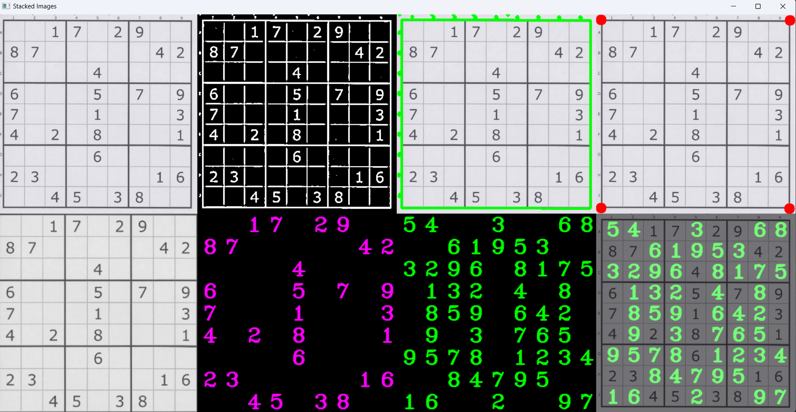

# Sudoku Solver using Computer Vision

This project is a computer vision-based Sudoku solver that detects a Sudoku puzzle from an image, recognizes the digits, solves the puzzle, and overlays the solution back onto the original image. It uses OpenCV for image processing, pytesseract for optical character recognition (OCR), and a backtracking algorithm to solve the Sudoku.

## Installation Guide

### Prerequisites

1. Install **Tesseract OCR**:
   - Visit the [Tesseract OCR GitHub page](https://github.com/tesseract-ocr/tesseract) for installation instructions.
   - After installation, set the Tesseract path in your code:
     ```python
     pytesseract.pytesseract.tesseract_cmd = r'C:/Program Files/Tesseract-OCR/tesseract.exe'
     ```

2. Install Python and required libraries.

### Steps

1. **Clone the repository:**
   ```bash
   git clone https://github.com/yourusername/sudoku-solver-cv.git
   cd sudoku-solver-cv
   ```

2. **Install dependencies:**
   ```bash
   pip install -r requirements.txt
   ```

3. **Place Sudoku Image:**
   - Place the Sudoku image in the `resources` folder. The default image is `resources/img.png`.

4. **Run the script:**
   ```bash
   python main.py
   ```

This will process the image, solve the Sudoku, and display the solution along with intermediate steps.

**Output Image:**

